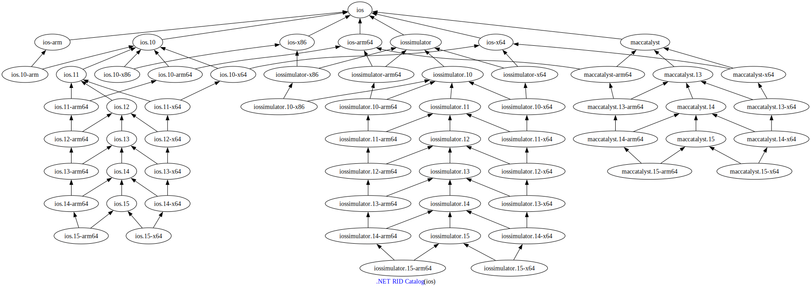

Generate visualizable [.NET runtime identifier][1] graphs in SVG



## About

This simple tool brings 4 awesome components together.

1. [Graphviz][2] for generating the SVG graph
2. The [NuGet.Packaging][3] library for reading the `runtime.json` file
3. The [GiGraph][4] library for generating the dot graph
4. The [CliWrap][5] library for making calling the `dot` command line tool a breeze

Have a look at GiGraph and CliWrap repositories, they have perfect READMEs! 🤩

## Usage

The `dot` command line tool must be installed, see the [Graphviz download][6] page to install it on your operating system.

- Generate the full graph of .NET runtime identifiers from the latest [runtime.json][7] definition

```shell
dotnet run > rid.svg
```

⚠️ The produced graph will be huge and pretty hard to read. See below for how to generate only parts of the graph.

- Generate a sub-graph for a given runtime identifier

```shell
dotnet run ios > rid-ios.svg
```

- Generate multiple sub-graphs for given runtime identifiers

```shell
dotnet run win aot > rid-win-aot.svg
```

[1]: https://docs.microsoft.com/en-us/dotnet/core/rid-catalog
[2]: https://graphviz.org
[3]: https://www.nuget.org/packages/NuGet.Packaging/
[4]: https://github.com/mariusz-schimke/GiGraph
[5]: https://github.com/Tyrrrz/CliWrap
[6]: https://graphviz.org/download/
[7]: https://github.com/dotnet/runtime/blob/main/src/libraries/Microsoft.NETCore.Platforms/src/runtime.json